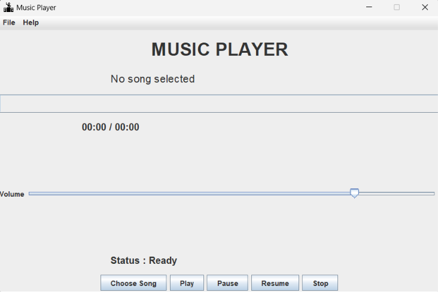

# 🎵 Music Player Application

A desktop-based **Music Player Application** developed using **Core Java**, **Java Swing**, and the **Java Sound API**. This application provides a simple and user-friendly interface to play WAV audio files with essential music playback controls.

---

## 📖 Project Overview

The Music Player Application is designed to demonstrate Core Java concepts such as GUI development, event handling, file handling, and audio processing. Users can select WAV audio files from their computer and control playback using an intuitive graphical interface.

---

## ✨ Features

- 🎵 Select and play WAV audio files
- ▶️ Play music
- ⏸️ Pause playback
- ⏯️ Resume playback
- ⏹️ Stop playback
- 📊 Real-time progress bar
- ⏱️ Song duration and playback timer
- 🔊 Volume control slider
- 📂 File menu for opening songs
- ℹ️ About dialog
- 🖥️ Simple and responsive Java Swing interface

---

## 🛠️ Technologies Used

- **Programming Language:** Java
- **GUI Framework:** Java Swing
- **Audio Library:** Java Sound API
- **IDE:** IntelliJ IDEA
- **Version Control:** Git
- **Repository Hosting:** GitHub

---

## 📂 Project Structure

```
upskillcampus
│
├── src
│   └── MusicPlayerApplication.java
│
├── README.md
├── music.png
├── window.png
├── song selection.png
├── song playing.png
├── song paused.png
├── song resume.png
└── song stopped.png
```

---

## 🚀 How to Run the Project

1. Clone the repository

```bash
git clone https://github.com/sathwikam12-art/upskillcampus.git
```

2. Open the project in **IntelliJ IDEA**.

3. Run the `MusicPlayerApplication.java` file.

4. Click **Choose Song** and select a **.wav** audio file.

5. Use the available controls:
   - Play
   - Pause
   - Resume
   - Stop

---

## 📸 Application Screenshots

### 🏠 Main Window



---

### 🎵 Song Selection


---

### ▶️ Song Playing


---

### ⏸️ Song Paused


---

### ⏯️ Song Resume


---

### ⏹️ Song Stopped


---

## 🎯 Learning Outcomes

During the development of this project, I gained practical experience in:

- Core Java programming
- Java Swing GUI development
- Event handling
- File handling
- Java Sound API
- Timer implementation
- Progress bar updates
- Volume control
- Git and GitHub
- Desktop application development

---

## 🔮 Future Enhancements

- Support for MP3 audio files
- Playlist management
- Shuffle and Repeat modes
- Dark mode theme
- Equalizer controls
- Album artwork display
- Keyboard shortcuts
- Drag-and-drop song loading

---

## 👩‍💻 Developer

**Sathwika**

B.Tech Computer Science Engineering Student

Core Java Internship Project

GitHub Profile:
https://github.com/sathwikam12-art

Repository:
https://github.com/sathwikam12-art/upskillcampus

---

## ⭐ If you found this project helpful, consider giving it a Star on GitHub!
